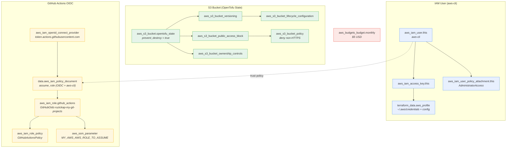
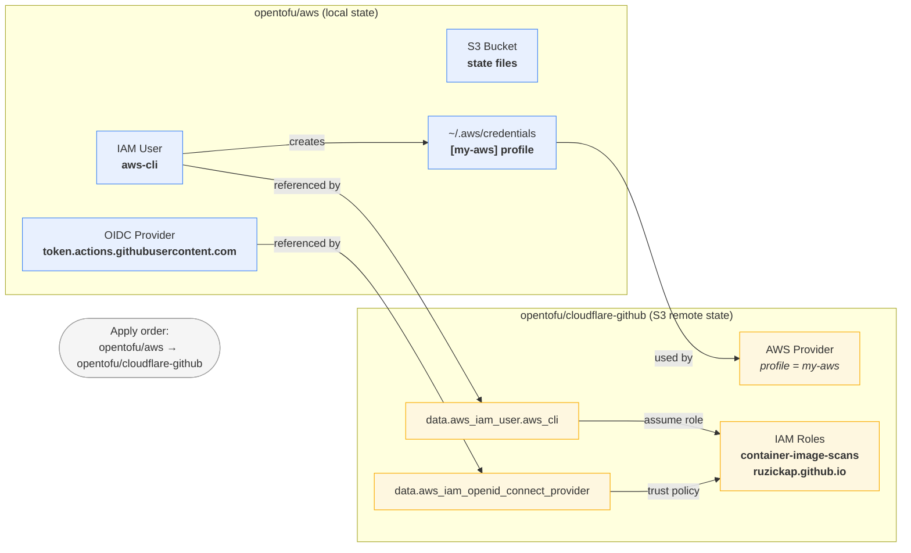

# OpenTofu - AWS

OpenTofu Infrastructure as Code project managing AWS IAM and S3
resources for personal infrastructure.

## Overview

This project provisions and manages:

- **IAM User** -- `aws-cli` with programmatic access and
  `AdministratorAccess`; access key credentials written to the
  `[my-aws]` profile in `~/.aws/credentials`
- **S3 Bucket** -- `ruzickap-my-git-projects-opentofu-state-files`
  for OpenTofu remote state storage (used by `cloudflare-github`
  module)
- **Budget Alert** -- monthly $5 USD cost budget with email
  notifications at 50% actual and 100% actual spend
- **GitHub Actions OIDC** -- OpenID Connect identity provider and
  `GitHubOidc-ruzickap-my-git-projects` IAM role for keyless CI
  authentication with SSM Parameter Store read/write, IAM role
  management, and OIDC provider management permissions

State is stored in a **local** file (`terraform.tfstate`).

## Architecture

### Resource Dependency Graph



### Cross-Module Dependencies



### Backend

- **Type**: Local (default)

### AWS Credentials

Credentials are written to the **standard** AWS CLI files using inline
`local-exec` provisioners that preserve other profiles already present
in the files:

- `~/.aws/credentials` -- access key ID and secret access key under
  the `[my-aws]` profile
- `~/.aws/config` -- region under `[profile my-aws]`

The `~/.aws/` directory is created automatically with `0700`
permissions if it does not exist. The provisioners use `sed` to
remove any existing `[my-aws]` section before appending the updated
one, leaving all other profiles untouched.

`opentofu/cloudflare-github/` uses `mise.toml` to set:

- `AWS_PROFILE=my-aws`

Since the credentials are in the standard `~/.aws/credentials` and
`~/.aws/config` files, no `AWS_SHARED_CREDENTIALS_FILE` or
`AWS_CONFIG_FILE` overrides are needed.

## Managed Resources

### IAM User (`aws-cli`)

Programmatic access user with `AdministratorAccess`. An access key is
generated and the `[my-aws]` profile is upserted into
`~/.aws/credentials` and `~/.aws/config`.

### S3 Bucket (`ruzickap-my-git-projects-opentofu-state-files`)

Stores OpenTofu state files for the `cloudflare-github` module.
Configured with:

- **Versioning** -- enabled (allows state recovery)
- **Encryption** -- SSE-S3 (AES-256), AWS default since January 2023
- **Public access** -- all public access blocked
- **Ownership** -- `BucketOwnerEnforced` (ACLs disabled)
- **Lifecycle rules** -- abort incomplete multipart uploads after
  7 days; expire noncurrent object versions after 90 days
- **Bucket policy** -- deny all non-HTTPS requests
- **Deletion protection** -- `prevent_destroy = true`

### Budget Alert (`monthly-account-budget`)

Monthly cost budget set to $5 USD. Email notifications are sent to
`petr.ruzicka@gmail.com` when:

- **Actual** spend exceeds **50%** ($2.50)
- **Actual** spend exceeds **100%** ($5.00)

### GitHub Actions OIDC (`GitHubOidc-ruzickap-my-git-projects`)

OpenID Connect identity provider
(`token.actions.githubusercontent.com`) and a single IAM role for
keyless GitHub Actions authentication from `ruzickap/my-git-projects`.

The role's inline policy (`GitHubActionsPolicy`) grants:

- **SSM Parameter Store** -- read/write access scoped to
  `/github/ruzickap/my-git-projects/*` and
  `/github/shared/actions-secrets/*`
- **IAM Role Management** -- create, update, and delete IAM roles
  matching `GitHubOidc-*` (used by the `cloudflare-github` module to
  provision OIDC roles for other repositories)
- **OIDC Provider Management** -- read access to the GitHub Actions
  OIDC provider
- **IAM User Read** -- read the `aws-cli` IAM user (referenced in
  assume-role trust policies)

The role is assumable via OIDC federation by
`repo:ruzickap/my-git-projects:*` and via `sts:AssumeRole` by the
`aws-cli` IAM user.

### Outputs

| Name                   | Sensitive | Description                             |
|------------------------|-----------|-----------------------------------------|
| `github_oidc_role_arn` | no        | ARN of the GitHub Actions OIDC IAM role |

## Prerequisites

### Initialize the AWS (Chicken-and-Egg)

OpenTofu provisions the `aws-cli` IAM user with an access key and
upserts the `[my-aws]` profile into `~/.aws/credentials` and
`~/.aws/config`. However, the AWS provider needs valid credentials
for the first run. To break this circular dependency:

1. **Create a temporary IAM user** in the AWS Console:
   - Go to **IAM** -> **Users** -> **Create user**
   - User name: `tmp-opentofu-bootstrap`
   - Attach the `AdministratorAccess` managed policy directly
   - Create an access key (**Security credentials** -> **Create access
     key**)
   - Save the Access Key ID and Secret Access Key

2. **Run the first `tofu apply`** using the temporary credentials:

   ```bash
   export AWS_ACCESS_KEY_ID="temporary-access-key-id"
   export AWS_SECRET_ACCESS_KEY="temporary-secret-access-key"
   tofu init
   tofu apply
   ```

   This provisions the `aws-cli` IAM user, generates its access key,
   and upserts the `[my-aws]` profile into `~/.aws/credentials` and
   `~/.aws/config`. Existing profiles in these files are preserved.

3. **Verify the profile** was created:

   ```bash
   grep -A2 '\[my-aws\]' ~/.aws/credentials
   ```

   Expected output:

   ```ini
   [my-aws]
   aws_access_key_id = AKIA...
   aws_secret_access_key = ...
   ```

   ```bash
   grep -A1 '\[profile my-aws\]' ~/.aws/config
   ```

   Expected output:

   ```ini
   [profile my-aws]
   region = eu-central-1
   ```

4. **Delete the temporary IAM user** from the AWS Console:
   - Go to **IAM** -> **Users** -> `tmp-opentofu-bootstrap`
   - Delete the access key, then delete the user

   Subsequent `tofu apply` runs use the `aws-cli` credentials from
   the `[my-aws]` profile in `~/.aws/credentials`:

   ```bash
   export AWS_PROFILE=my-aws
   ```

## Run OpenTofu

After the initial bootstrap (see above), subsequent runs use the
`[my-aws]` profile from the standard `~/.aws/credentials`:

```bash
export AWS_PROFILE=my-aws
tofu init
tofu apply
```
