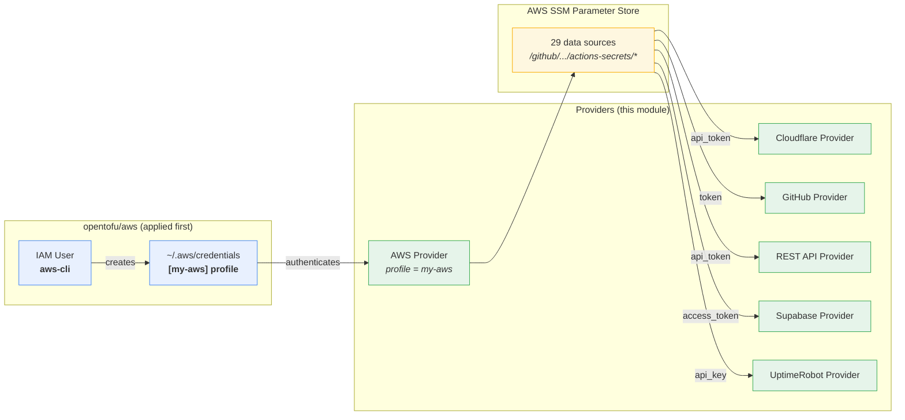
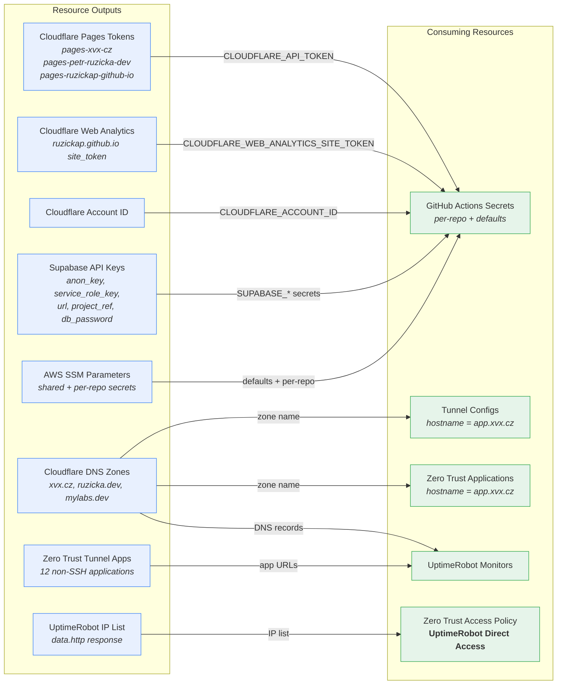

# OpenTofu - Cloudflare - GitHub

OpenTofu Infrastructure as Code project managing personal infrastructure
across Cloudflare, GitHub, Supabase, and UptimeRobot.

## Overview

This project provisions and manages:

- **Cloudflare** -- DNS zones with DNSSEC, DNS records, redirect rulesets,
  compression rules, cache rules, Observatory scheduled tests, Zero Trust
  tunnels and access policies, API tokens, email routing, notification
  policies, Web Analytics, and Pages projects
- **GitHub** -- repositories with settings, branch protection rulesets,
  Actions secrets, topics, workflow permissions, and GitHub Pages
  configuration
- **Supabase** -- Database project (`container-image-scans`) for container
  image scanning
- **UptimeRobot** -- HTTP monitors for all public domains and Zero Trust
  tunnel applications, plus a public status page (`stats.xvx.cz`)
- **AWS** -- SSM Parameter Store data sources for GitHub Actions secrets

State is stored **encrypted** (AES-GCM with PBKDF2 key) in an AWS S3
bucket. Secrets are passed via `TF_VAR_*` environment variables.

## Architecture

### Backend

- **Type**: AWS S3
- **Bucket**: `ruzickap-my-git-projects-opentofu-state-files`
- **Encryption**: AES-GCM with PBKDF2-derived key (enforced)
- **Lock file**: Enabled (`use_lockfile = true`)

### Provider and Secrets Flow



### Resource Dependency Graph

```mermaid
flowchart TD
    subgraph cf_zones ["Cloudflare DNS Zones"]
        zone_xvx["cloudflare_zone<br/><b>xvx.cz</b>"]
        zone_ruzicka["cloudflare_zone<br/><b>ruzicka.dev</b>"]
        zone_mylabs["cloudflare_zone<br/><b>mylabs.dev</b>"]
        zone_common["Per-zone resources:<br/><i>DNSSEC, DNS records, zone settings,<br/>rulesets (compression, cache, redirects),<br/>email routing</i>"]
    end

    zone_xvx --> zone_common
    zone_ruzicka --> zone_common
    zone_mylabs --> zone_common

    subgraph cf_zt ["Cloudflare Zero Trust"]
        tunnels["cloudflare_zero_trust_tunnel_cloudflared<br/><b>gate, raspi</b>"]
        tunnel_configs["cloudflare_zero_trust_tunnel_cloudflared_config"]
        zt_apps["cloudflare_zero_trust_access_application<br/><i>12 non-SSH apps</i>"]
        google_idp["cloudflare_zero_trust_access_identity_provider<br/><b>Google OAuth</b>"]
        policy_google["access_policy<br/><b>Google SSO Access</b>"]
        policy_ur["access_policy<br/><b>UptimeRobot Direct Access</b>"]
        policy_all["access_policy<br/><b>Allow All</b>"]
        ur_ip_list["cloudflare_zero_trust_list<br/><b>UptimeRobot IPs</b>"]
        http_ur_ips["data.http<br/><i>UptimeRobot IPv4/IPv6</i>"]
        zt_tags["cloudflare_zero_trust_access_tag<br/><i>7 tags</i>"]
    end

    tunnels --> tunnel_configs
    zone_xvx -.->|hostname domain| tunnel_configs
    zone_xvx -.->|app domain| zt_apps
    google_idp -->|allowed_idps| zt_apps
    policy_google -->|default policy| zt_apps
    policy_ur -->|default policy| zt_apps
    policy_all -->|hass-rpi only| zt_apps
    http_ur_ips --> ur_ip_list
    ur_ip_list --> policy_ur

    subgraph cf_tokens ["Cloudflare API Tokens"]
        perm_groups["data.cloudflare_account_api_token_permission_groups_list"]
        token_main["cloudflare_account_token<br/><b>opentofu-cloudflare-github</b>"]
        token_xvx["cloudflare_account_token<br/><b>pages-xvx-cz</b>"]
        token_petr["cloudflare_account_token<br/><b>pages-petr-ruzicka-dev</b>"]
        token_ruzickap["cloudflare_account_token<br/><b>pages-ruzickap-github-io</b>"]
    end

    perm_groups --> token_main
    perm_groups --> token_xvx
    perm_groups --> token_petr
    perm_groups --> token_ruzickap

    subgraph cf_other ["Cloudflare (other)"]
        pages["cloudflare_pages_project<br/><i>3 projects</i>"]
        analytics["cloudflare_web_analytics_site<br/><i>2 sites</i>"]
        notif["cloudflare_notification_policy<br/><i>7 policies</i>"]
    end

    tunnels -.->|tunnel_id filter| notif

    subgraph github ["GitHub"]
        repos["github_repository<br/><i>27 repos (for_each)</i>"]
        wf_perms["github_workflow_repository_permissions"]
        secrets["github_actions_secret<br/><i>defaults + per-repo</i>"]
        topics["github_repository_topics"]
        rulesets["github_repository_ruleset<br/><i>public repos only</i>"]
    end

    repos --> wf_perms
    repos --> secrets
    repos --> topics
    repos --> rulesets

    subgraph supa ["Supabase"]
        rng_pw["random_password"]
        supa_proj["supabase_project<br/><b>container-image-scans</b>"]
        supa_keys["data.supabase_apikeys"]
    end

    rng_pw --> supa_proj
    supa_proj --> supa_keys

    subgraph ur ["UptimeRobot"]
        ur_zt_mon["uptimerobot_monitor<br/><b>zero_trust_applications</b>"]
        ur_domain_mon["uptimerobot_monitor<br/><b>domain_monitors</b>"]
        ur_psp["uptimerobot_psp<br/><b>My Services Status</b>"]
    end

    zt_apps -.->|app URLs| ur_zt_mon
    zone_xvx -.->|DNS records| ur_domain_mon
    zone_ruzicka -.->|DNS records| ur_domain_mon
    zone_mylabs -.->|DNS records| ur_domain_mon
    ur_zt_mon --> ur_psp
    ur_domain_mon --> ur_psp

    classDef cfZone fill:#fff3e0,stroke:#f57c00
    classDef cfZt fill:#e8f0fe,stroke:#4285f4
    classDef cfToken fill:#fce4ec,stroke:#c62828
    classDef cfOther fill:#f3e5f5,stroke:#7b1fa2
    classDef ghStyle fill:#e8f5e9,stroke:#2e7d32
    classDef supaStyle fill:#e0f2f1,stroke:#00695c
    classDef urStyle fill:#fef7e0,stroke:#f9ab00

    class zone_xvx,zone_ruzicka,zone_mylabs,zone_common cfZone
    class tunnels,tunnel_configs,zt_apps,google_idp,policy_google,policy_ur,policy_all,ur_ip_list,http_ur_ips,zt_tags cfZt
    class perm_groups,token_main,token_xvx,token_petr,token_ruzickap cfToken
    class pages,analytics,notif cfOther
    class repos,wf_perms,secrets,topics,rulesets ghStyle
    class rng_pw,supa_proj,supa_keys supaStyle
    class ur_zt_mon,ur_domain_mon,ur_psp urStyle
```



### Cross-Provider Data Flows



### Secrets Management

All secrets are passed via `TF_VAR_*` environment variables -- there is
no encrypted secrets file. The single variable defined in
`variables.tf` (`opentofu_encryption_passphrase`) and all provider
credentials are set as environment variables prefixed with `TF_VAR_`
before running `tofu plan` or `tofu apply`.

- **Local development** -- export `TF_VAR_*` variables in your shell
  (or use a secrets manager like 1Password, `pass`, etc.)
- **GitHub Actions CI** -- the workflow sets `TF_VAR_*` environment
  variables from repository secrets

### Variables

Only one OpenTofu variable is defined in `variables.tf`:

| Name                             | Sensitive | Description                    |
|----------------------------------|-----------|--------------------------------|
| `opentofu_encryption_passphrase` | yes       | OpenTofu encryption passphrase |

Set it via `TF_VAR_opentofu_encryption_passphrase`.

### Environment Variables (`TF_VAR_*`)

The remaining secrets are **not** OpenTofu variables -- they are read
from AWS SSM Parameter Store via `data "aws_ssm_parameter"` data
sources. In the GitHub Actions CI workflow they are passed as
`TF_VAR_*` environment variables (sourced from repository secrets).
For local development, export them in your shell before running
`tofu plan` or `tofu apply`.

| Name                                                                        | Description                                                |
|-----------------------------------------------------------------------------|------------------------------------------------------------|
| `cloudflare_zero_trust_access_identity_provider_google_oauth_client_id`     | Google OAuth client ID for Cloudflare Zero Trust           |
| `cloudflare_zero_trust_access_identity_provider_google_oauth_client_secret` | Google OAuth client secret for Cloudflare Zero Trust       |
| `dockerhub_container_registry_password`                                     | DockerHub container registry password                      |
| `dockerhub_container_registry_user`                                         | DockerHub container registry username                      |
| `gh_token_opentofu_cloudflare_github`                                       | GitHub PAT for managing Cloudflare and GitHub resources    |
| `google_client_id`                                                          | Google client ID                                           |
| `google_client_secret`                                                      | Google client secret                                       |
| `mise_sops_age_key_container_image_scans`                                   | SOPS AGE key for container-image-scans repository          |
| `my_atlassian_personal_token`                                               | Atlassian personal access token                            |
| `my_renovate_github_app_id`                                                 | Renovate GitHub App ID                                     |
| `my_renovate_github_private_key`                                            | Renovate GitHub App private key                            |
| `my_slack_bot_token`                                                        | Slack bot token                                            |
| `my_slack_channel_id`                                                       | Slack channel ID                                           |
| `opentofu_cloudflare_github_api_token`                                      | Cloudflare API token for OpenTofu cloudflare-github module |
| `quay_container_registry_password`                                          | Quay container registry password                           |
| `quay_container_registry_user`                                              | Quay container registry username                           |
| `ruzicka_sbx01_aws_role_to_assume`                                          | AWS role ARN to assume for ruzicka-sbx01 account           |
| `sops_age_key_my_git_projects`                                              | SOPS AGE key for my-git-projects repository                |
| `supabase_access_token`                                                     | Supabase access token                                      |
| `uptimerobot_api_key`                                                       | UptimeRobot API key                                        |
| `wifi_password`                                                             | WiFi password for Raspberry Pi configuration               |
| `wifi_ssid`                                                                 | WiFi SSID for Raspberry Pi configuration                   |
| `wiz_client_id`                                                             | Wiz client ID                                              |
| `wiz_client_secret`                                                         | Wiz client secret                                          |

### Outputs

| Name                                               | Sensitive |
|----------------------------------------------------|-----------|
| `supabase_container_image_scans_apikeys`           | yes       |
| `supabase_container_image_scans_endpoint`          | no        |
| `supabase_container_image_scans_database_password` | yes       |
| `supabase_container_image_scans_env_yaml`          | yes       |

## Managed Resources

### Cloudflare DNS Zones

Each zone has DNSSEC enabled, minimum TLS 1.3 enforced, Zstandard
compression (with Brotli and Gzip fallbacks), and cache rules for static
file extensions.

| Zone          | Email Provider           | Features                                                                             |
|---------------|--------------------------|--------------------------------------------------------------------------------------|
| `mylabs.dev`  | Mailtrap                 | Redirect to `petr.ruzicka.dev`, AWS Route 53 NS delegation (`aws`, `k8s` subdomains) |
| `ruzicka.dev` | Cloudflare Email Routing | Blog redirect (`blog.ruzicka.dev` to `ruzickap.github.io`), GoatCounter analytics    |
| `xvx.cz`      | Google Workspace         | Zero Trust tunnel CNAME records, UptimeRobot status page redirect (`stats.xvx.cz`)   |

### Cloudflare Zero Trust

Two tunnels (`gate`, `raspi`) hosting 14 applications on the `xvx.cz`
domain:

| Tunnel  | Application       | Service                  | Tags                      |
|---------|-------------------|--------------------------|---------------------------|
| `gate`  | `gate`            | `https://127.0.0.1`      | lan, router, wan          |
| `gate`  | `gate-ssh`        | `ssh://127.0.0.1:22`     | lan, router, ssh, wan     |
| `gate`  | `msr-2`           | `http://192.168.1.4`     | iot, wifi                 |
| `gate`  | `transmission`    | `http://127.0.0.1:9091`  | router                    |
| `gate`  | `uzg-01`          | `http://192.168.1.3`     | iot, lan                  |
| `raspi` | `alloy-rpi`       | `http://localhost:12345` | rpi, wifi                 |
| `raspi` | `esphome-rpi`     | `http://localhost:6052`  | container, iot, rpi, wifi |
| `raspi` | `grafana-rpi`     | `http://localhost:3001`  | rpi, wifi                 |
| `raspi` | `hass-rpi`        | `http://localhost:8123`  | container, iot, rpi, wifi |
| `raspi` | `kodi-rpi`        | `http://localhost:8080`  | rpi, wifi                 |
| `raspi` | `prometheus-rpi`  | `http://localhost:9090`  | rpi, wifi                 |
| `raspi` | `rpi`             | `http://127.0.0.1:3000`  | container, rpi, wifi      |
| `raspi` | `rpi-ssh`         | `ssh://127.0.0.1:22`     | rpi, ssh, wifi            |
| `raspi` | `zigbee2mqtt-rpi` | `http://localhost:8082`  | container, iot, rpi, wifi |

Access policies:

- **Google SSO Access** -- email-based allow policy
- **UptimeRobot Direct Access** -- bypass policy using UptimeRobot IP list
- **Allow All** -- bypass policy (used by `hass-rpi`)

### Cloudflare API Tokens

| Token Name                                          | Permissions                     |
|-----------------------------------------------------|---------------------------------|
| `opentofu-cloudflare-github`                        | 10 account + 6 zone permissions |
| `cloudflare-account-token-pages-xvx-cz`             | Pages Write                     |
| `cloudflare-account-token-pages-petr-ruzicka-dev`   | Pages Write                     |
| `cloudflare-account-token-pages-ruzickap-github-io` | Pages Write                     |

Main token account-scoped permissions: Access (Apps and Policies,
Organizations/Identity Providers/Groups, Service Tokens), Account API
Tokens, Account Settings, Cloudflare Tunnel, Email Routing Addresses,
Pages, Zero Trust.

Main token zone-scoped permissions: Cache Settings, DNS, Dynamic URL
Redirects, Response Compression, Zone Settings, Zone.

### Cloudflare Notification Policies

| Alert                               | Type                           |
|-------------------------------------|--------------------------------|
| Abuse Report Alert                  | `abuse_report_alert`           |
| Expiring Access Service Token Alert | `expiring_service_token_alert` |
| Passive Origin Monitoring           | `real_origin_monitoring`       |
| Web Analytics Metrics Update        | `web_analytics_metrics_update` |
| Incident Alert                      | `incident_alert` (critical)    |
| Tunnel Health Alert                 | `tunnel_health_event`          |

### Cloudflare Pages Projects

| Project              | Production Branch |
|----------------------|-------------------|
| `petr-ruzicka-dev`   | `main`            |
| `ruzickap-github-io` | `main`            |
| `xvx-cz`             | `main`            |

### Cloudflare Web Analytics

| Site                    | Auto Install |
|-------------------------|--------------|
| `brewwatch.lovable.app` | no           |
| `ruzickap.github.io`    | no           |

### GitHub Repositories

27 repositories managed with consistent settings:

- Squash/rebase merge only (merge commits disabled)
- Auto-delete head branches on merge
- Apache 2.0 license (default)
- Vulnerability alerts enabled
- Secret scanning with push protection (public repos)
- Branch protection rulesets on default branch (public repos): 2 required
  reviews, code owner review, linear history, status checks
- Renovate bot bypass for direct update branches
- Default Actions secrets applied to all repositories (Renovate app
  credentials, Slack bot token)

### UptimeRobot

HTTP monitors (300s interval) for:

- All public CNAME records across `xvx.cz`, `ruzicka.dev`, and `mylabs.dev`
- All non-SSH Zero Trust tunnel applications
- Proxied A records on `xvx.cz`

Public status page: `stats.xvx.cz`

### Supabase

- **Project**: `container-image-scans` (us-east-1)
- Random 16-character database password

### AWS

GitHub Actions secrets are read from AWS SSM Parameter Store at
`/github/<repo>/actions-secrets/<secret>` (per-repo) and
`/github/shared/actions-secrets/<secret>` (shared defaults).

The AWS provider uses the `my-aws` profile from the standard
`~/.aws/credentials` and `~/.aws/config` files (the `AWS_PROFILE` env
var is set in `mise.toml`), provisioned by the
[`opentofu/aws`](../aws/) module.

The `aws-cli` IAM user is managed in the separate
[`opentofu/aws`](../aws/) module.

## Prerequisites

### Apply the `opentofu/aws` Module First

The AWS provider in this module uses the `my-aws` profile from the
standard `~/.aws/credentials` file (the `AWS_PROFILE` env var is set
in `mise.toml`). The profile is created by the
[`opentofu/aws`](../aws/) module. You **must** run `tofu apply` there
before initializing this module, otherwise the AWS provider fails with:

```text
Error: failed to get shared config profile, my-aws
```

See the [`opentofu/aws` README](../aws/README.md) for bootstrap
instructions.

### Create Cloudflare Account API Token

1. Navigate to **Manage Account** -> **Account API Tokens**

2. Fill in the **Create Custom Token** form:

   | Token Name                                                                         |
   |------------------------------------------------------------------------------------|
   | `opentofu-cloudflare-github (ruzickap/my-git-projects/opentofu/cloudflare-github)` |

   | Permission | Access             | Purpose |
   |------------|--------------------|---------|
   | `Account`  | `Account Settings` | `Edit`  |
   | `Account`  | `API Tokens`       | `Edit`  |

3. Click **Continue to summary** to review and create the token

## Run OpenTofu

This creates scoped API tokens with permissions for the main `cloudflare`
OpenTofu configuration and stores credentials as GitHub Actions secrets.

```bash
# Set all TF_VAR_* secrets (see Environment Variables table above)
export TF_VAR_opentofu_encryption_passphrase="..."
export TF_VAR_opentofu_cloudflare_github_api_token="..."
export TF_VAR_gh_token_opentofu_cloudflare_github="..."
export TF_VAR_supabase_access_token="..."
export TF_VAR_uptimerobot_api_key="..."
export TF_VAR_cloudflare_zero_trust_access_identity_provider_google_oauth_client_id="..."
export TF_VAR_cloudflare_zero_trust_access_identity_provider_google_oauth_client_secret="..."
export TF_VAR_my_renovate_github_app_id="..."
export TF_VAR_my_renovate_github_private_key="..."
export TF_VAR_my_slack_bot_token="..."
export TF_VAR_my_slack_channel_id="..."
export TF_VAR_mise_sops_age_key_container_image_scans="..."
export TF_VAR_wiz_client_id="..."
export TF_VAR_wiz_client_secret="..."
export TF_VAR_wifi_password="..."
export TF_VAR_wifi_ssid="..."
export TF_VAR_dockerhub_container_registry_password="..."
export TF_VAR_dockerhub_container_registry_user="..."
export TF_VAR_quay_container_registry_password="..."
export TF_VAR_quay_container_registry_user="..."
export TF_VAR_ruzicka_sbx01_aws_role_to_assume="..."
export TF_VAR_sops_age_key_my_git_projects="..."
export TF_VAR_google_client_id="..."
export TF_VAR_google_client_secret="..."
export TF_VAR_my_atlassian_personal_token="..."

# Ensure the my-aws profile exists (created by opentofu/aws)
export AWS_PROFILE=my-aws

tofu init
tofu apply
```

## Get OpenTofu Outputs

After applying - retrieve outputs:

```bash
# List all outputs
tofu output

# Get Supabase endpoint
tofu output supabase_container_image_scans_endpoint

# Get sensitive outputs (e.g., Supabase API keys)
tofu output -json supabase_container_image_scans_apikeys | jq -r 'to_entries[] | "\(.key): \(.value)"'
```

## Notes

### List Cloudflare API Token Permissions

Retrieve all available permission names when adding new permissions to
`cloudflare_account_token.tf`:

```bash
ACCOUNT_ID=$(curl -s "https://api.cloudflare.com/client/v4/accounts" -H "Authorization: Bearer ${OPENTOFU_CLOUDFLARE_GITHUB_API_TOKEN}" | jq -r '.result[0].id')

# Account-scoped permissions
curl -s "https://api.cloudflare.com/client/v4/accounts/${ACCOUNT_ID}/iam/permission_groups" -H "Authorization: Bearer ${OPENTOFU_CLOUDFLARE_GITHUB_API_TOKEN}" | jq '.result[] | select(.meta.scopes == "com.cloudflare.api.account")'

# Zone-scoped permissions
curl -s "https://api.cloudflare.com/client/v4/accounts/${ACCOUNT_ID}/iam/permission_groups" -H "Authorization: Bearer ${OPENTOFU_CLOUDFLARE_GITHUB_API_TOKEN}" | jq '.result[] | select(.meta.scopes == "com.cloudflare.api.account.zone")'
```

### Container Testing (Clean Environment)

Test the OpenTofu configuration in an isolated container to ensure it
works from scratch without local dependencies:

```console
docker run -it --rm -v "${PWD}:/mnt" alpine

cd /mnt || exit
apk add --no-cache curl jq opentofu

export TF_VAR_opentofu_encryption_passphrase="..."
export TF_VAR_opentofu_cloudflare_github_api_token="..."
export TF_VAR_gh_token_opentofu_cloudflare_github="..."
# ... set remaining TF_VAR_* variables (see Environment Variables table above)

# Ensure the my-aws profile exists (created by opentofu/aws)
export AWS_PROFILE=my-aws

tofu init
tofu plan
```

or

```console
docker run -it --rm -v "${PWD}:/mnt" alpine

cd /mnt || exit
apk add --no-cache bash mise
# shellcheck disable=SC2016 # Single quotes intentional - expansion happens when .bashrc is sourced
echo 'eval "$(/usr/bin/mise activate bash)"' >> ~/.bashrc
bash

mise trust --yes
export TF_VAR_opentofu_encryption_passphrase="..."
export TF_VAR_opentofu_cloudflare_github_api_token="..."
export TF_VAR_gh_token_opentofu_cloudflare_github="..."
# ... set remaining TF_VAR_* variables (see Environment Variables table above)

mise up
tofu init
tofu plan
```
